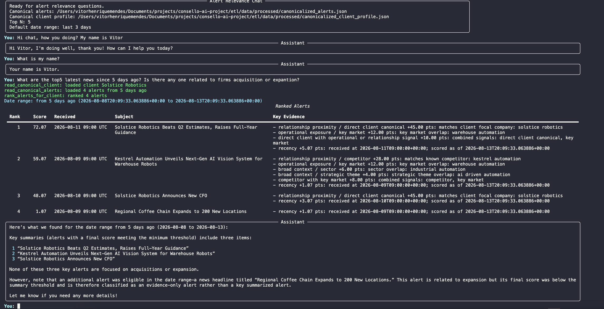

# Consello AI Alert Intelligence

Python monorepo for turning financial-news alerts into structured, canonical,
and relevance-ranked intelligence for a configured client.

## Description

The project implements an alert-intelligence workflow in two main stages:

- `etl`: extraction and canonicalization pipeline that reads raw alert JSON,
  uses OpenAI models through LangChain to extract metadata, normalizes entities,
  and maps items to a canonical catalog.
- `ai-alert-scorer`: conversational LangChain/LangGraph agent that reads the
  canonical ETL artifacts, filters alerts by time window, calculates a
  deterministic relevance score, and uses the model to explain the ranked
  results to the user.

The main technologies are Python 3.11+, Pydantic, LangChain, LangGraph, the
OpenAI SDK, python-dotenv, Rich, pytest, and editable Python package installs.
The repository also keeps agent workflow context in `.codex/` and contribution
rules in `AGENTS.md` files.

The problem this repository addresses is alert overload for advisory teams.
Advisors receive a constant stream of media-alert emails about earnings, deals,
executive moves, regulatory actions, and macro developments, but only a small
fraction of those alerts matter for any one client relationship. Important
alerts may not mention the client directly; they can be relevant because they
mention a competitor, supplier, customer, regulator, key market, commodity, or
macro theme connected to that client. This project turns that noisy stream into
a short ranked list of client-relevant alerts, with explainable scoring evidence
for why each alert made the cut.

The implementation keeps the model-driven parts and deterministic business
logic separate. LLMs help extract and canonicalize alert metadata, while the
scorer ranks alerts with an auditable matrix of relationship, exposure, theme,
combination, and recency signals. Expected future improvements include a larger
canonical catalog, better pipeline observability, visual run examples, and a
richer conversational scoring experience.



## Structure

Representative directory tree, with local environments, caches, `.env`, and
tool-specific lock files omitted:

```text
.
|-- ai-alert-scorer
|   |-- src
|   |   `-- ai_alert_scorer
|   |       |-- agent.py              # LangGraph/LangChain orchestration
|   |       |-- app                   # Chat CLI and terminal presentation
|   |       |-- config.py             # Runtime configuration
|   |       |-- date_ranges.py        # Relative and absolute date handling
|   |       |-- io.py                 # Canonical alert/profile loading
|   |       |-- schemas.py            # Pydantic data contracts
|   |       |-- scoring.py            # Deterministic relevance scoring
|   |       `-- tools.py              # Agent tools
|   |-- tests                         # Scorer test suite
|   |-- README.md
|   |-- scoring.md
|   `-- pyproject.toml
|-- etl
|   |-- data
|   |   |-- config
|   |   |   `-- canonical_catalog.json
|   |   |-- raw                       # Sample alert and client inputs
|   |   `-- processed                 # Generated ETL artifacts
|   |-- src
|   |   `-- etl
|   |       |-- app                   # ETL CLI
|   |       |-- canonicalization      # Catalog matching and canonical output
|   |       |-- common                # Shared config, IO, schemas, fields
|   |       `-- extraction            # Metadata extraction pipeline
|   |-- tests                         # ETL test suite
|   |-- README.md
|   `-- pyproject.toml
|-- docs
|   |-- development-guide.md
|   `-- project-agents-overview.md
|-- openspec
|   |-- changes                       # Proposed or in-progress changes
|   |-- specs                         # Accepted behavior specs
|   `-- config.yaml
|-- .codex                          # Local agent workflow context
|-- .env.example                    # Environment variable template
|-- AGENTS.md                       # Repository-wide agent/contributor rules
|-- README.md
`-- requirements.txt
```

## How To Install And Run The Project

### Prerequisites

- Python 3.11 or newer.
- OpenAI credentials for commands that call models or embeddings.

### Create A Virtual Environment

From the repository root:

```bash
python -m venv .venv
source .venv/bin/activate
python -m pip install --upgrade pip
```

On Windows, activate the environment with:

```powershell
.venv\Scripts\activate
```

### Configure Environment Variables

Create a local `.env` file from the repository example:

```bash
cp .env.example .env
```

Fill in at least:

```bash
OPENAI_API_KEY=...
DATA_EXTRACTOR_MODEL=o3-mini
STANDARD_DATA_MODEL=o3-mini
STANDARD_DATA_EMBEDDING_MODEL=text-embedding-3-small
```

The model names above are examples. Use models available in your OpenAI
project.

### Install The Packages

Install both local packages into the active virtual environment:

```bash
python -m pip install -e "./etl[test]"
python -m pip install -e "./ai-alert-scorer[test]"
```

Confirm both CLIs are importable:

```bash
python -m etl.app.cli --help
python -m ai_alert_scorer.app.cli --help
```

### Run Tests

```bash
python -m pytest etl/tests
python -m pytest ai-alert-scorer/tests
```

## How To Use The Project

### 1. Generate Enriched Alerts

This command reads `etl/data/raw/sample_alerts.json`, calls the extraction
model, and writes `etl/data/processed/enriched_alerts.json`.

```bash
python -m etl.app.cli run
```

To inspect the prompt before calling the API:

```bash
python -m etl.app.cli prompt --alert-id a13
```

### 2. Canonicalize Alerts And The Client Profile

After extraction, run canonicalization:

```bash
python -m etl.app.cli canonicalize
```

This command uses the catalog in `etl/data/config/canonical_catalog.json` and
generates:

- `etl/data/processed/canonicalized_alerts.json`
- `etl/data/processed/canonicalized_client_profile.json`

### 3. Chat With The Relevance Scorer

With canonical artifacts generated, start the chat:

```bash
python -m ai_alert_scorer.app.cli \
  --canonical-alerts-path etl/data/processed/canonicalized_alerts.json \
  --canonical-client-profile-path etl/data/processed/canonicalized_client_profile.json
```

Example questions:

```text
What are the top alerts from the last 3 days?
Show the top 2 alerts from 2026-08-11T00:00:00Z to 2026-08-11T23:59:59Z.
Summarize the most relevant alerts for today.
```

To reproduce a fixed date against sample data, use `--as-of`:

```bash
python -m ai_alert_scorer.app.cli --as-of 2026-08-11
```

## Extra Documents

- [ETL README](etl/README.md)
- [ETL Walkthrough](docs/etl-walkthrough.md)
- [AI Alert Scorer README](ai-alert-scorer/README.md)
- [Development Guide](docs/development-guide.md)
- [Project Agents Overview](docs/project-agents-overview.md)
- [General agent rules](AGENTS.md)
- [Project OpenSpec config](openspec/config.yaml)

## Status

This repository is a proof of concept. The main commands, tests, and sample
data exist locally, while production integrations, deployment, observability,
and visual documentation can still evolve.
