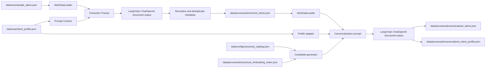

# Alert Extraction ETL

## Project Overview

`consello-alert-etl` is a Python ETL package for turning raw financial-news
alerts into structured metadata used by downstream Consello systems, including
the Agent Service.

The project has two processing stages:

1. **Alert extraction** reads raw alert JSON, asks an OpenAI chat model through
   LangChain for first-pass structured metadata, normalizes the result, and
   writes enriched alerts.
2. **Canonicalization** reads enriched alerts plus a customer profile, projects
   possible canonical catalog matches, asks a second OpenAI chat model to choose
   canonical IDs, and writes canonicalized alert/profile outputs.

Expected inputs:

- Raw alerts: JSON array of alert objects with `id`, `received_at`, `subject`,
  and `body`.
- Customer profile: JSON object with profile context such as companies, markets,
  regulators, and themes.
- Canonical catalog: versioned JSON object defining allowed canonical IDs for
  each supported metadata field.

Expected outputs:

- Enriched alerts: JSON array preserving raw alert fields and adding extracted
  metadata arrays.
- Canonicalized alerts: JSON array preserving alert fields and metadata items,
  with a `canonical` ID attached to each item when a catalog match is selected.
- Canonicalized customer profile: profile-shaped JSON object containing
  canonical IDs for profile fields.

## Architecture

The ETL is organized around explicit data boundaries: schema-validated JSON IO,
prompt/model orchestration, post-processing, and canonical catalog matching.



Main package boundaries:

- `etl.app` owns CLI parsing and command dispatch.
- `etl.common` owns shared configuration, schemas, field constants, JSON IO,
  and OpenAI model construction.
- `etl.extraction` owns first-pass alert metadata prompts, structured model
  calls, normalization, and extraction orchestration.
- `etl.canonicalization` owns catalog loading, candidate generation,
  canonicalization prompts, model-decision validation, and alert/profile
  canonicalization.

## Project Structure

```text
etl/
+-- data/
|   +-- raw/
|   |   +-- sample_alerts.json
|   |   +-- client_profile.json
|   +-- config/
|   |   +-- canonical_catalog.json
|   +-- processed/
|       +-- enriched_alerts.json
|       +-- canonical_embedding_index.json
|       +-- canonicalized_alerts.json
|       +-- canonicalized_client_profile.json
+-- src/
|   +-- main.py
|   +-- etl/
|       +-- app/cli.py
|       +-- common/
|       +-- extraction/
|       +-- canonicalization/
+-- tests/
+-- pyproject.toml
```

Important paths:

| Path | Responsibility |
| --- | --- |
| `src/etl/app/cli.py` | Installed `alert-extraction-etl` command and subcommands. |
| `src/etl/common/config.py` | Default file paths and OpenAI-related environment configuration. |
| `src/etl/common/io.py` | JSON file reads/writes, validation loaders, and merge-by-id record storage. |
| `src/etl/common/schemas.py` | Pydantic schemas for raw and enriched alert records. |
| `src/etl/extraction/` | First-pass metadata prompt construction, model invocation, and normalization. |
| `src/etl/canonicalization/` | Canonical catalog schema, candidate projection, canonicalization service, and profile adapters. |
| `tests/` | Unit tests for CLI/config, schemas, IO, prompts, extraction, and canonicalization. |

## Application / Data Flow

### Alert Extraction

```text
Raw alert JSON array
   |
   v
AlertDataLoader validates RawAlert records
   |
   v
build_synthesis_prompt creates one prompt per alert
   |
   v
ChatOpenAI.with_structured_output(AlertMetadata)
   |
   v
normalize_alert_metadata lower-cases names/tickers and deduplicates per field
   |
   v
JsonRecordStore merges records by alert id
   |
   v
data/processed/enriched_alerts.json
```

The extraction pipeline uses a `ThreadPoolExecutor` with
`ALERT_EXTRACTION_WORKERS = 20` to process alerts concurrently. The lower-level
`enrich_alert()` function supports `context_hints`, and the `prompt` command
loads the client profile as prompt context. In the current `run` implementation,
client-profile loading is commented out, so live extraction runs use the alert
subject/body only.

### Canonicalization

```text
Enriched alerts + customer profile + canonical catalog
   |
   v
Pydantic validation of enriched alerts and catalog
   |
   v
Profile adapter maps profile fields into the shared metadata payload
   |
   v
CanonicalCandidateGenerator projects candidates for each source item
   |
   v
build_canonicalization_prompt sends only projected candidates to the model
   |
   v
ChatOpenAI.with_structured_output(CanonicalizationDecision)
   |
   v
Validation rejects count changes, out-of-candidate IDs, and out-of-catalog IDs
   |
   v
Canonicalized alert array + profile-shaped canonicalized profile object
```

Alert canonicalization preserves source alert fields and original metadata
names, tickers, and rationales. It adds `canonical` to each metadata item, using
`null` when no supported catalog value is selected.

Profile canonicalization adapts fields like `client_name`, `focal_companies`,
`competitors`, `suppliers`, `customers`, `sector`, `geo_markets`, `key_markets`,
`commodities`, `regulators`, `macro_sensitivities`, and `themes` into the shared
metadata payload, then projects canonical IDs back into a profile-shaped output.

## Key Components

| Component | Inputs | Outputs | Notes |
| --- | --- | --- | --- |
| `ETLConfig` | Optional raw/profile/output paths | Extraction path config | Defaults point under `etl/data/`. |
| `CanonicalizationConfig` | Optional enriched/profile/catalog/index/output paths | Canonicalization path config | Uses separate canonicalized alert and profile outputs. |
| `AlertDataLoader` | JSON files | Validated `RawAlert`, `EnrichedAlert`, or profile mapping | Fails when JSON roots have the wrong shape. |
| `JsonRecordStore` | Pydantic models or mappings | JSON array persisted to disk | Replaces incoming records with matching IDs, preserves old unmatched records, appends new IDs. |
| `build_synthesis_prompt()` | Alert subject/body and optional context hints | Model-facing extraction prompt | Dynamic values are escaped and wrapped in XML-style tags. |
| `extract_alert_metadata()` | `RawAlert` and structured-output model | `AlertMetadata` | Validates mapping responses into Pydantic models. |
| `CanonicalCandidateGenerator` | First-pass metadata and catalog | Per-item candidate projection | Uses deterministic matches first, then embedding similarity when available. |
| `canonicalize_payload()` / `canonicalize_alert()` | Metadata payload, catalog, model, candidates | Canonicalized metadata or alert | Validates model choices against projected candidates and catalog values. |

Supported metadata fields are:

- `companies`
- `sectors`
- `geo_markets`
- `key_markets`
- `commodities`
- `regulators`
- `macro_sensitivities`
- `themes`

## Configuration

The project loads environment variables with `python-dotenv`. When running from
the `etl/` directory, a local `etl/.env` file can be used, or values can be
exported in the shell.

| Variable | Required | Used By | Description |
| --- | --- | --- | --- |
| `OPENAI_API_KEY` | Yes for live model/API calls | OpenAI SDK, LangChain | API key used by chat and embedding clients. |
| `DATA_EXTRACTOR_MODEL` | Yes for `run` | Extraction | Chat model name or deployment name for first-pass alert extraction. |
| `DATA_EXTRACTOR_TEMPERATURE` | No | Extraction | Float sampling temperature. Omitted when unset. |
| `DATA_EXTRACTOR_REASONING_EFFORT` | No | Extraction | Optional OpenAI reasoning `effort` value passed through to `ChatOpenAI`. |
| `DATA_EXTRACTOR_REASONING_SUMMARY` | No | Extraction | Optional OpenAI reasoning `summary` value passed through to `ChatOpenAI`. |
| `STANDARD_DATA_MODEL` | Yes for `canonicalize` | Canonicalization | Chat model name or deployment name for canonical decisions. |
| `STANDARD_DATA_TEMPERATURE` | No | Canonicalization | Float sampling temperature. Omitted when unset. |
| `STANDARD_DATA_REASONING_EFFORT` | No | Canonicalization | Optional OpenAI reasoning `effort` value passed through to `ChatOpenAI`. |
| `STANDARD_DATA_REASONING_SUMMARY` | No | Canonicalization | Optional OpenAI reasoning `summary` value passed through to `ChatOpenAI`. |
| `STANDARD_DATA_EMBEDDING_MODEL` | No | Candidate generation | Embedding model for catalog similarity search. Defaults to `text-embedding-3-small`. |

Default file paths are defined in `src/etl/common/config.py`:

| Purpose | Default |
| --- | --- |
| Raw alert input | `data/raw/sample_alerts.json` |
| Customer profile input | `data/raw/client_profile.json` |
| Enriched alert output | `data/processed/enriched_alerts.json` |
| Canonical catalog | `data/config/canonical_catalog.json` |
| Catalog embedding index/cache | `data/processed/canonical_embedding_index.json` |
| Canonicalized alert output | `data/processed/canonicalized_alerts.json` |
| Canonicalized profile output | `data/processed/canonicalized_client_profile.json` |

## Setup

Prerequisites:

- Python 3.11 or newer.
- OpenAI credentials for commands that call models or embeddings.

Create and activate a virtual environment from the repository root:

```bash
python -m venv .venv
source .venv/bin/activate
python -m pip install --upgrade pip
```

On Windows, activate the environment with:

```powershell
.venv\Scripts\activate
```

Install the ETL package with test dependencies:

```bash
python -m pip install -e "./etl[test]"
```

Optional `.env` example:

```bash
OPENAI_API_KEY=...
DATA_EXTRACTOR_MODEL=gpt-4.1-mini
DATA_EXTRACTOR_TEMPERATURE=0
STANDARD_DATA_MODEL=gpt-4.1-mini
STANDARD_DATA_TEMPERATURE=0
STANDARD_DATA_EMBEDDING_MODEL=text-embedding-3-small
```

Model names are examples only; use models available to your OpenAI project.

## Running The Project

Show CLI help:

```bash
python -m etl.app.cli --help
```

Run first-pass extraction with default paths:

```bash
python -m etl.app.cli
```

The parser treats a no-subcommand invocation as `run`, so the command above is
equivalent to:

```bash
python -m etl.app.cli run
```

Run extraction with explicit paths:

```bash
python -m etl.app.cli run \
  --input-path etl/data/raw/sample_alerts.json \
  --client-profile-path etl/data/raw/client_profile.json \
  --output-path etl/data/processed/enriched_alerts.json
```

Preview the extraction prompt without calling OpenAI or writing output:

```bash
python -m etl.app.cli prompt
```

Preview the prompt for one alert:

```bash
python -m etl.app.cli prompt \
  --input-path etl/data/raw/sample_alerts.json \
  --client-profile-path etl/data/raw/client_profile.json \
  --alert-id a13
```

Run canonicalization with default paths:

```bash
python -m etl.app.cli canonicalize
```

Run canonicalization with explicit paths:

```bash
python -m etl.app.cli canonicalize \
  --input-path etl/data/processed/enriched_alerts.json \
  --client-profile-path etl/data/raw/client_profile.json \
  --catalog-path etl/data/config/canonical_catalog.json \
  --embedding-index-path etl/data/processed/canonical_embedding_index.json \
  --output-path etl/data/processed/canonicalized_alerts.json \
  --profile-output-path etl/data/processed/canonicalized_client_profile.json
```

## Data Shapes

Raw alert input:

```json
[
  {
    "id": "a01",
    "received_at": "2026-08-11T09:00:00+00:00",
    "subject": "Solstice Robotics Beats Q2 Estimates",
    "body": "Solstice Robotics (SLRB) reported Q2 revenue..."
  }
]
```

Enriched alert output:

```json
[
  {
    "id": "a01",
    "received_at": "2026-08-11T09:00:00+00:00",
    "subject": "Solstice Robotics Beats Q2 Estimates",
    "body": "Solstice Robotics (SLRB) reported Q2 revenue...",
    "companies": [
      {
        "name": "solstice robotics",
        "ticker": "slrb",
        "rationale": "The alert names Solstice Robotics."
      }
    ],
    "sectors": [],
    "geo_markets": [],
    "key_markets": [],
    "commodities": [],
    "regulators": [],
    "macro_sensitivities": [],
    "themes": []
  }
]
```

Canonicalized alert output:

```json
[
  {
    "id": "a01",
    "received_at": "2026-08-11T09:00:00+00:00",
    "subject": "Solstice Robotics Beats Q2 Estimates",
    "body": "Solstice Robotics (SLRB) reported Q2 revenue...",
    "companies": [
      {
        "name": "solstice robotics",
        "ticker": "slrb",
        "canonical": "solstice_robotics",
        "rationale": "The alert names Solstice Robotics."
      }
    ],
    "sectors": []
  }
]
```

Canonicalized customer profile output:

```json
{
  "client_name": "Solstice Robotics",
  "ticker": "SLRB",
  "sector": "industrial_automation",
  "focal_companies": ["solstice_robotics"],
  "competitors": ["kestrel_automation"],
  "suppliers": ["ferrotech_alloys"],
  "customers": ["northline_logistics"],
  "geo_markets": ["germany", "mexico"],
  "key_markets": ["warehouse_automation"],
  "commodities": ["rare_earth_magnets"],
  "regulators": ["cfius"],
  "macro_sensitivities": ["interest_rates"],
  "themes": ["ai_driven_automation"]
}
```

## Canonical Catalog

Canonicalization uses `data/config/canonical_catalog.json`. The catalog is a
Pydantic-validated JSON object with:

- `version`: positive integer catalog version.
- `fields`: exactly one entry for each supported metadata field.
- `values`: stable canonical IDs for each field.

Each catalog value includes:

- `label`: readable display label.
- `aliases`: direct naming variants for deterministic matching.
- `related_terms`: semantic hints used in embedding text and model reasoning.
- `law_or_regime_aliases`: explicit law/regime/review aliases that may map to a
  regulator entity.
- `exclude`: nearby terms that must not map to this entry.
- `description`: boundary description for the canonical value.

Catalog validation fails before model calls if a supported field is missing, an
unknown field is present, or a field has no allowed values.

Candidate generation order:

1. Normalize the source item with case folding and punctuation/whitespace
   cleanup.
2. Check deterministic matches against canonical ID, label, alias, acronym, and
   exclusions.
3. For `regulators`, allow law/regime/review/framework terms to map to
   regulator entity IDs only through explicit `law_or_regime_aliases`.
4. If there is not exactly one deterministic candidate and an embedding client
   is configured, search the field-scoped catalog embedding index.

The embedding index is stored locally as JSON and is compatible only when the
catalog version, catalog content hash, and embedding model match. Catalog edits
or embedding model changes cause the index to be rebuilt.

## Testing

Tests are under `tests/` and use `pytest`. They cover:

- CLI argument normalization and command dispatch.
- Environment configuration parsing.
- JSON loading and merge-by-id storage.
- Pydantic schema contracts.
- Prompt construction.
- Extraction orchestration with fake structured-output models.
- Canonical catalog validation.
- Candidate generation and embedding-index cache behavior.
- Canonicalization decision validation and profile projection.

Run all tests:

```bash
python -m pytest etl/tests
```

Run a focused test file:

```bash
python -m pytest etl/tests/test_canonicalization.py
```

## Development Guide

Follow the existing package boundaries:

- Put shared constants, config, schemas, and IO in `etl.common`.
- Put first-pass alert extraction logic in `etl.extraction`.
- Put canonical catalog and standardization logic in `etl.canonicalization`.
- Put CLI behavior in `etl.app.cli`.
- Keep tests in `tests/`, with fake model/client classes for model and
  embedding boundaries.

Implementation conventions visible in the codebase:

- Use Pydantic models at JSON and model-output boundaries.
- Keep file IO behind `StorageBackend`, `AlertDataLoader`, or `JsonRecordStore`.
- Preserve raw alert fields unchanged in enriched and canonicalized outputs.
- Normalize first-pass extracted names and tickers to lower case during
  post-processing.
- Preserve original metadata names, tickers, and rationales during
  canonicalization.
- Validate canonical model decisions before writing outputs.
- Prefer `null` canonical values over weak unsupported mappings.
- Use type hints and Google-style docstrings for public modules, classes, and
  functions.

`pyproject.toml` includes Ruff configuration (`E`, `F`, `I`, `UP`, `B`, line
length 88), but Ruff is not listed as a project dependency. Install or run Ruff
separately if you want to lint locally.

## External Dependencies

| Dependency | Purpose |
| --- | --- |
| `langchain-openai` / `langchain` | Binds OpenAI chat models to Pydantic structured-output schemas. |
| `openai` | Calls embeddings API for canonical catalog similarity search. |
| `pydantic` | Validates raw alerts, enriched alerts, catalog data, model decisions, and outputs. |
| `python-dotenv` | Loads local environment variables before reading model configuration. |
| Local filesystem JSON | Stores raw inputs, processed outputs, catalog config, and embedding index cache. |

There are no database, queue, or deployment integrations defined in this ETL
package.

## Troubleshooting

| Symptom | Likely Cause | Fix |
| --- | --- | --- |
| `Missing required environment variable: DATA_EXTRACTOR_MODEL` | Running `run` without extraction model config. | Set `DATA_EXTRACTOR_MODEL` in the shell or `.env`. |
| `Missing required environment variable: STANDARD_DATA_MODEL` | Running `canonicalize` without canonicalization model config. | Set `STANDARD_DATA_MODEL` in the shell or `.env`. |
| OpenAI client authentication error | `OPENAI_API_KEY` is missing or not visible to the process. | Export `OPENAI_API_KEY` or add it to `etl/.env` when running from `etl/`. |
| `Environment variable ... must be a float` | Temperature env var is present but not numeric. | Use values such as `0`, `0.1`, or unset the variable. |
| `Raw alert dataset must be a JSON array` | Raw input file root is not an array. | Use a JSON array of objects with `id`, `received_at`, `subject`, and `body`. |
| `Client profile context must be a JSON object` | Profile input root is not an object. | Use a single JSON object for the profile. |
| Catalog validation error for missing or unknown fields | Catalog fields do not exactly match supported metadata fields. | Update `data/config/canonical_catalog.json` to include exactly the supported field set. |
| Canonical decision returned an ID outside candidates | Model selected a value that was not projected for that item. | Improve aliases/related terms in the catalog or inspect the canonicalization prompt with tests/fakes. |
